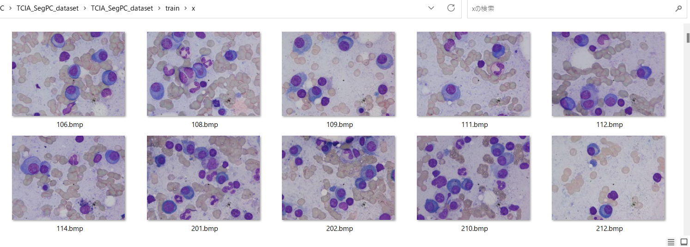
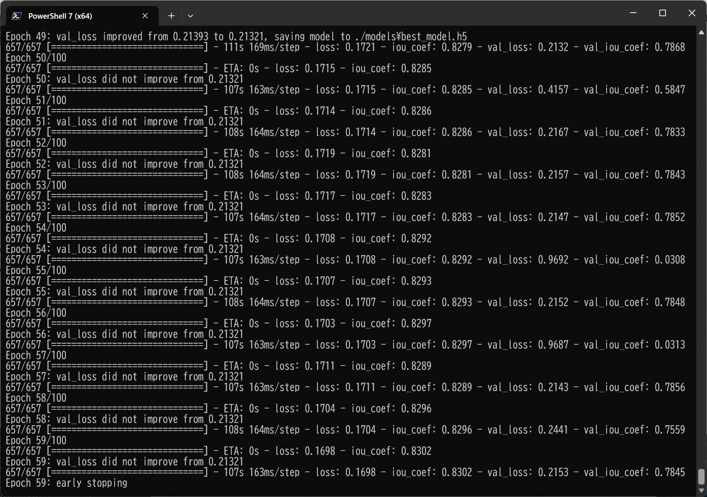
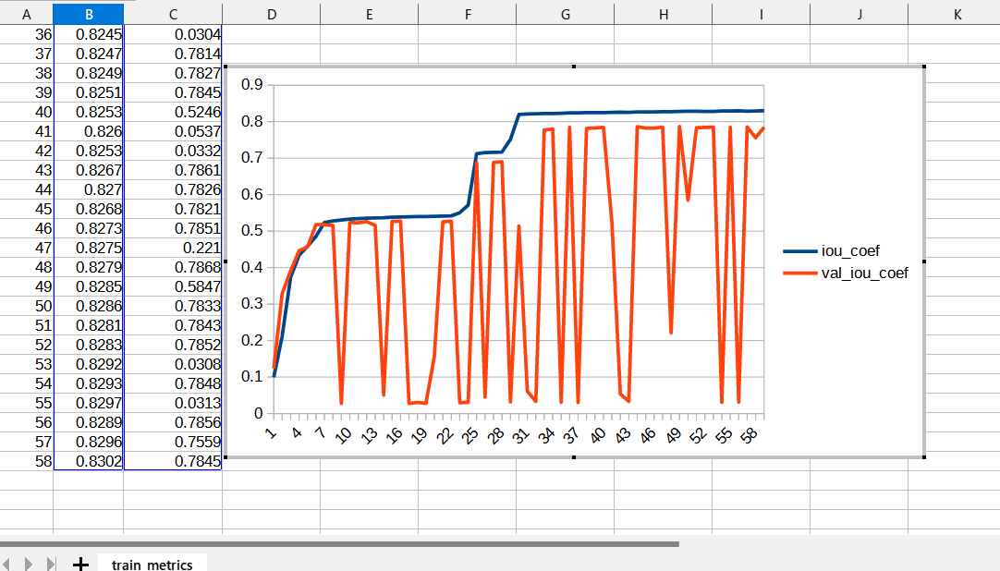
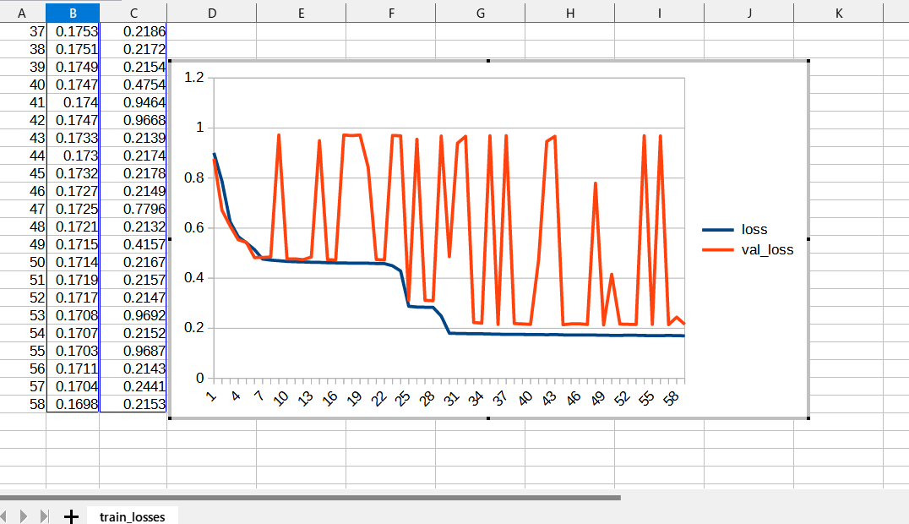
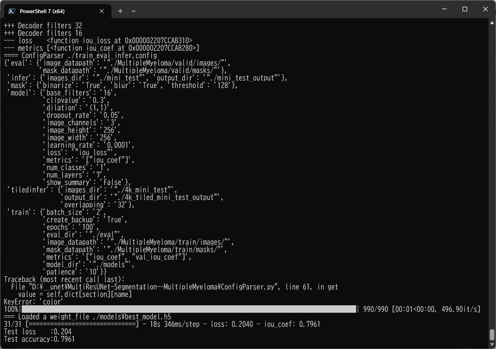
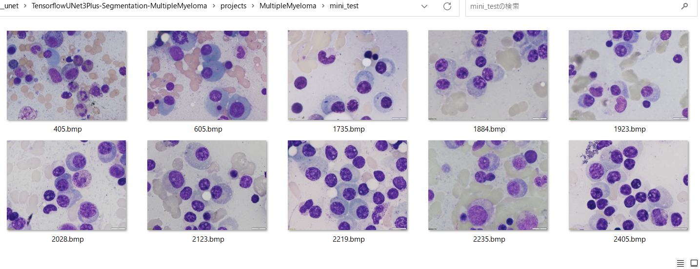
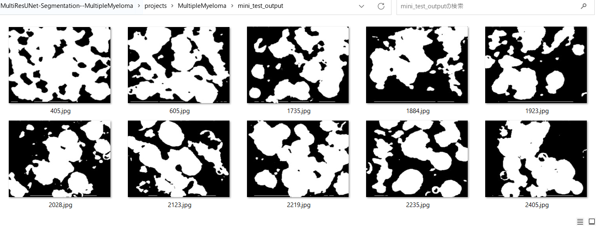
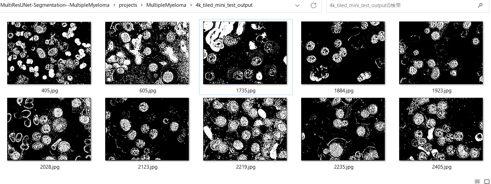

# TensorflowMultiResUNet-Segmentation-MultipleMyeloma (Updated: 2023/07/02)

<h2>
1 TensorflowMultiResUNet-Segmentation-MultipleMyelom
</h2>

This is an experimental project detect MultipleMyeloma by using 
<a href="https://github.com/sarah-antillia/Tensorflow-Slightly-Flexible-MultiRes-UNet">TensorflowMultiResUNet</a> Model. 
In order to write the TensorflowMultiResUNet python class, we have used the Python scripts in the following web sites.

<pre>
1. Semantic-Segmentation-Architecture
 https://github.com/nikhilroxtomar/Semantic-Segmentation-Architecture/blob/main/TensorFlow/multiresunet.py
</pre>

Please see also:

<pre>
2. U-Net: Convolutional Networks for Biomedical Image Segmentation
 https://arxiv.org/pdf/1505.04597.pdf
</pre>
<pre>
3.MultiResUNet : Rethinking the U-Net architecture for multimodal biomedical image segmentation
 https://www.sciencedirect.com/science/article/abs/pii/S0893608019302503
</pre>

The original dataset used here has been take from the following  web site:  
<b>SegPC-2021-dataset</b> 
SegPC-2021: Segmentation of Multiple Myeloma Plasma Cells in Microscopic Images 
<pre>
https://www.kaggle.com/datasets/sbilab/segpc2021dataset
</pre>
Citation: 
<pre>
Anubha Gupta, Ritu Gupta, Shiv Gehlot, Shubham Goswami, April 29, 2021, "SegPC-2021: Segmentation of Multiple Myeloma Plasma Cells 
in Microscopic Images", IEEE Dataport, doi: https://dx.doi.org/10.21227/7np1-2q42.
BibTex
@data{segpc2021,
doi = {10.21227/7np1-2q42},
url = {https://dx.doi.org/10.21227/7np1-2q42},
author = {Anubha Gupta; Ritu Gupta; Shiv Gehlot; Shubham Goswami },
publisher = {IEEE Dataport},
title = {SegPC-2021: Segmentation of Multiple Myeloma Plasma Cells in Microscopic Images},
year = {2021} }
IMPORTANT:
If you use this dataset, please cite below publications-
1. Anubha Gupta, Rahul Duggal, Shiv Gehlot, Ritu Gupta, Anvit Mangal, Lalit Kumar, Nisarg Thakkar, and Devprakash Satpathy, 
 "GCTI-SN: Geometry-Inspired Chemical and Tissue Invariant Stain Normalization of Microscopic Medical Images," 
 Medical Image Analysis, vol. 65, Oct 2020. DOI: 
 (2020 IF: 11.148)
2. Shiv Gehlot, Anubha Gupta and Ritu Gupta, 
 "EDNFC-Net: Convolutional Neural Network with Nested Feature Concatenation for Nuclei-Instance Segmentation,"
 ICASSP 2020 - 2020 IEEE International Conference on Acoustics, Speech and Signal Processing (ICASSP), 
 Barcelona, Spain, 2020, pp. 1389-1393.
3. Anubha Gupta, Pramit Mallick, Ojaswa Sharma, Ritu Gupta, and Rahul Duggal, 
 "PCSeg: Color model driven probabilistic multiphase level set based tool for plasma cell segmentation in multiple myeloma," 
 PLoS ONE 13(12): e0207908, Dec 2018. DOI: 10.1371/journal.pone.0207908
License
CC BY-NC-SA 4.0
</pre>

<h2>
2. Prepare MultipleMyelom dataset
</h2>
<h3>
2.1. Download 
</h3>
Please download original <b>Multiple Myeloma Plasma Cells</b> dataset from the following link.
<b>SegPC-2021-dataset</b> 
SegPC-2021: Segmentation of Multiple Myeloma Plasma Cells in Microscopic Images 
<pre>
https://www.kaggle.com/datasets/sbilab/segpc2021dataset
</pre>
The folder structure of the dataset is the following. 
<pre>
TCIA_SegPC_dataset
├─test
│  └─x
├─train
│  ├─x
│  └─y
└─valid
    ├─x
    └─y
</pre>
Each <b>x</b> folder of the dataset contains the ordinary image files of Multiple Myeloma Plasma Cells,
and <b>y</b> folder contains the mask files to identify each Cell of the ordinary image files.
  Both the image size of all files in <b>x</b> and <b>y</b> is 2560x1920 (2.5K), which is apparently too large to use 
for our TensoflowUNet Model. 

Sample images in train/x: 
 
Sample masks in train/y: 
 

<h3>
2.2. Generate MultipleMyeloma Image Dataset
</h3>
 We have created Python script <a href="./projects/MultipleMyeloma/generator/MultipleMyelomaImageDatasetGenerator.py">
 <b>MultipleMyelomaImageDatasetGenerator.py</b></a> to create images and masks dataset. 
 This script will perform following image processing. 
 <pre>
 1 Resize all bmp files in <b>x</b> and <b>y</b> folder to 256x256 square image.
 2 Create clear white-black mask files from the original mask files.
 3 Create cropped images files corresponding to each segmented region in mask files in <b>y</b> folders.
</pre>

See also the following web-site on Generation of MultipleMyeloma Image Dataset. 
<a href="https://github.com/atlan-antillia/Image-Segmentation-Multiple-Myeloma">Image-Segmentation-Multiple-Myeloma </a>
 

<h3>
2.3 Generated MultipleMyeloma dataset. 
</h3>
Finally, we have generated the resized jpg files dataset below.  
<pre>
└─projects
    └─MultipleMyeloma
        └─MultipleMyeloma
            ├─train
            │  ├─images
            │  └─masks
            └─valid
                ├─images
                └─masks
</pre>

<h2>
3. Create TensorflowMultiResUNet Model
</h2>
 You can customize your <a href="./TensorflowMultiResUNet.py">TensorflowMultiResUNet</a> model by using a configration file. 
 The following is the case of MultipleMyeloma segmentation dataset. 
Please note that loss and metrics functions based on IoU (Intersection over Union) in model section. 
<pre>
loss    = "iou_loss"
metrics = ["iou_coef"]
</pre>
 
<pre>
; train_eval_infer.config
; 2023/7/2 antillia.com

[model]
image_width    = 256
image_height   = 256

image_channels = 3
num_classes    = 1
base_filters   = 16
num_layers     = 7
dropout_rate   = 0.05
learning_rate  = 0.0001
dilation       = (1,1)
clipvalue      = 0.3
loss           = "iou_loss"
metrics        = ["iou_coef"]
show_summary   = False

[train]
epochs        = 100
batch_size    = 2
patience      = 10
metrics       = ["iou_coef", "val_iou_coef"]
model_dir     = "./models"
eval_dir      = "./eval"
image_datapath = "./MultipleMyeloma/train/images/"
mask_datapath  = "./MultipleMyeloma/train/masks/"
create_backup  = True

[eval]
image_datapath = "./MultipleMyeloma/valid/images/"
mask_datapath  = "./MultipleMyeloma/valid/masks/"

[infer] 
images_dir    = "./mini_test" 
output_dir    = "./mini_test_output"

[tiledinfer] 
overlapping = 32
images_dir = "./4k_mini_test"
output_dir = "./4k_tiled_mini_test_output"

[mask]
blur      = True
binarize  = True
threshold = 128
</pre>

 
You will pass the filename of this configuration file to <a href="./TensorflowMultiResUNet.py">TensorflowMultiResUNet</a> constructor to create your model 
in the following way: 
<pre>
  config_file = "./train_eval_infer.config"
  model       = TensorflowMultiResUNet(config_file)
</pre>

<h2>
4 Train TensorflowMultiResUNet Model
</h2>
 We can create and train your TensorflowMultiResUNet model by MultipleMyeloma dataset defined in the <b>train_eval_infer.config</b> file. 

We can use <a href="./ImageMaskDataset.py">ImageMaskDataset</a> class to create <b>train</b> and <b>test</b> dataset from the 
the original downloaded file. 
Please move to <b>./projects/MultipleMyeloma/</b>, and run the following bat file.
<pre>
>1.train.bat
</pre>
which simply runs the Python script 
<a href="./TensorflowMultiResUNetTrainer.py">TensorflowMultiResUNetTrainer.py</a>
<pre>
python ../../TensorflowMultiResUNetTrainer.py ./train_eval_infer.config
</pre>

<b>Training console output</b> 

 
 
<b>Train metrics: iou_coef</b>, which shows Excessive Fluctuation. 
 

 
<b>Train losses: iou_loss</b>, which shows Excessive Fluctuation 
 

<h2>
5 Evaluation
</h2>
 We can evaluate the prediction(segmentation) accuracy in <b>test</b> dataset by using our Trained TensorflowMultiResUNet Model,
and <b>train_eval_infer.config</b> file. 
Please move to <b>./projects/MultipleMyeloma/</b>, and run the following bat file.
<pre>
>2.evaluate.bat
</pre>
, which runs the Python script 
<a href="./TensorflowMultiResUNetEvaluator.py">TensorflowMultiResUNetEvaluator.py</a>
<pre>
python ../../TensorflowMultiResUNetEvaluator.py ./train_eval_infer.config
</pre>
<b>Evaluation console output</b> 
 
 

<h2>
6 Non Tiled Image Segmentation
</h2>
Please move to <b>./projects/MultipleMyeloma/</b>, and run the following bat file. 
<pre>
>3.infer.bat
</pre>
which runs the Python script 
<a href="./TensorflowMultiResUNetInferencer.py">TensorflowMultiResUNetInferencer.py</a>
<pre>
python ../../TensorflowMultiResUNetInferencer.py  ./train_eval_infer.config
</pre>

<b>Input images 2.5K (mini_test)</b> 
 
 
<b>Infered images (mini_test_output)</b> 

  

<h2>
7 Overlapped Tiled Image Segmentation 
</h2>
Please move to <b>./projects/MultipleMyeloma/</b>, and run the following bat file. 
<pre>
>4.tiled_infer.bat
</pre>
which runs the Python script 
<a href="./TensorflowMultiResUNetTiledInferencer.py">TensorflowMultiResUNetTiledInferencer.py</a>
<pre>
python ../../TensorflowMultiResUNetTiledInferencer.py  ./train_eval_infer.config
</pre>
 
 
<b>Overlapped-Tiled-Image-Segmentation: Infered images (4k_mini_test_output)</b> 

  

Please refer to our experiment on <b>Overlapped-Tiled-Image-Segmentation</b> based on UNet3Plus Model. 
<a href="https://github.com/sarah-antillia/TensorflowUNet3Plus-Segmentation-MultipleMyeloma">
TensorflowUNet3Plus-Segmentation-MultipleMyeloma</a>
  
<h3>
References
</h3>

<b>1.MultiResUNet : Rethinking the U-Net architecture for multimodal biomedical image segmentation</b> 
Nabil Ibtehaz, M. Sohel Rahman 
<pre>
 https://www.sciencedirect.com/science/article/abs/pii/S0893608019302503
</pre>

<b>2. Semantic-Segmentation-Architecture</b> 
<pre>
 https://github.com/nikhilroxtomar/Semantic-Segmentation-Architecture/blob/main/TensorFlow/multiresunet.py
</pre>

<b>3.Image-Segmentation-MultipleMyeloma</b> 
Toshiyuki Arai @antillia.com
 
<pre>
https://github.com/atlan-antillia/Image-Segmentation-MultipleMyeloma
</pre>

<b>4.TensorflowUNet3Plus-Segmentation-MultipleMyeloma</b> 
Toshiyuki Arai @antillia.com
 
<pre>
https://github.com/sarah-antillia/TensorflowUNet3Plus-Segmentation-MultipleMyeloma
</pre>

<b>5. Semantic-Segmentation-Loss-Functions (SemSegLoss)</b> 
<pre>
https://github.com/shruti-jadon/Semantic-Segmentation-Loss-Functions
</pre>
<pre>
Citation
@inproceedings{jadon2020survey,
  title={A survey of loss functions for semantic segmentation},
  author={Jadon, Shruti},
  booktitle={2020 IEEE Conference on Computational Intelligence in Bioinformatics and Computational Biology (CIBCB)},
  pages={1--7},
  year={2020},
  organization={IEEE}
}
@article{JADON2021100078,
title = {SemSegLoss: A python package of loss functions for semantic segmentation},
journal = {Software Impacts},
volume = {9},
pages = {100078},
year = {2021},
issn = {2665-9638},
doi = {https://doi.org/10.1016/j.simpa.2021.100078},
url = {https://www.sciencedirect.com/science/article/pii/S2665963821000269},
author = {Shruti Jadon},
keywords = {Deep Learning, Image segmentation, Medical imaging, Loss functions},
abstract = {Image Segmentation has been an active field of research as it has a wide range of applications, 
ranging from automated disease detection to self-driving cars. In recent years, various research papers 
proposed different loss functions used in case of biased data, sparse segmentation, and unbalanced dataset. 
In this paper, we introduce SemSegLoss, a python package consisting of some of the well-known loss functions 
widely used for image segmentation. It is developed with the intent to help researchers in the development 
of novel loss functions and perform an extensive set of experiments on model architectures for various 
applications. The ease-of-use and flexibility of the presented package have allowed reducing the development 
time and increased evaluation strategies of machine learning models for semantic segmentation. Furthermore, 
different applications that use image segmentation can use SemSegLoss because of the generality of its 
functions. This wide range of applications will lead to the development and growth of AI across all industries.
}
}

 
